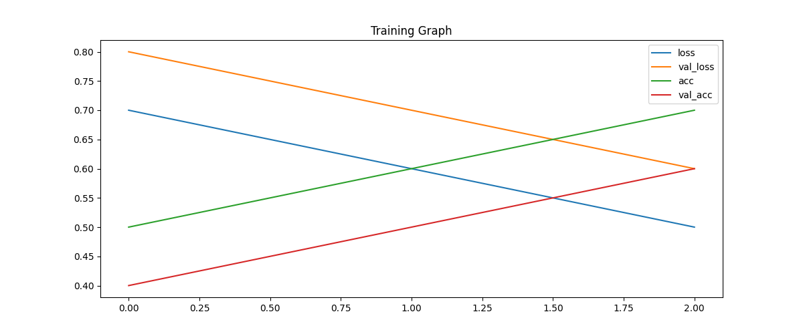

# Image Classification Project (Cats vs Dogs)

## Dataset
The dataset consists of cat and dog images obtained from a public dataset. 
Images were manually annotated using Roboflow annotation tools.

## Data Preparation
The dataset was split into training, validation, and test sets.
- Training: 70%
- Validation: 20%
- Test: 10%

## Preprocessing
All images were resized to 224x224 pixels and normalized by rescaling pixel values to the range [0,1].

## Data Augmentation
Data augmentation was not applied in this project to keep the baseline model simple.

## Model Selection
A Convolutional Neural Network (CNN) was selected due to its strong performance in image classification tasks.
CNNs are effective at learning spatial features such as edges, textures, and shapes in images.

The following academic studies were reviewed before selecting the model:

1. Krizhevsky et al., ImageNet Classification with Deep Convolutional Neural Networks  
   https://papers.nips.cc/paper/2012/hash/c399862d3b9d6b76c8436e924a68c45b-Abstract.html

2. LeCun et al., Gradient-Based Learning Applied to Document Recognition  
   http://yann.lecun.com/exdb/publis/pdf/lecun-98.pdf

3. Simonyan & Zisserman, Very Deep Convolutional Networks for Large-Scale Image Recognition  
   https://arxiv.org/abs/1409.1556

4. He et al., Deep Residual Learning for Image Recognition  
   https://arxiv.org/abs/1512.03385

5. Howard et al., MobileNets: Efficient Convolutional Neural Networks for Mobile Vision Applications  
   https://arxiv.org/abs/1704.04861

## Training
The model was trained using TensorFlow and Keras for 5 epochs.
Categorical cross-entropy loss and Adam optimizer were used.

## Results
Training and validation accuracy and loss values were recorded during training.
Accuracy and loss graphs were generated and saved in the models/ directory.

## Reproducibility
The project is fully reproducible by cloning the repository and running the training script located in src/train.py.
## Model Eğitim Grafikleri

